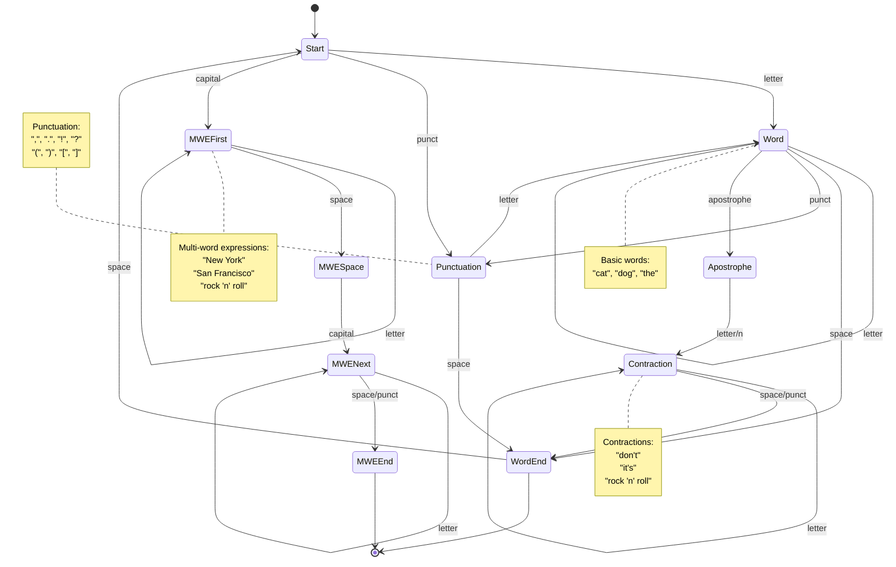

/opt/homebrew/bin/python3.11 -m venv quantum_env_311
rm -rf quantum_env_311
source quantum_env_311/bin/activate
pip install -r requirements.txt
pip install --upgrade pip

install uv:
curl -LsSf https://astral.sh/uv/install.sh | sh

uv pip compile pyproject.toml --generate-hashes -o requirements.txt

uv pip sync requirements.txt

uv pip compile requirements.txt --refresh
uv sync # generated uv.lock

chmod +x entrypoint.sh